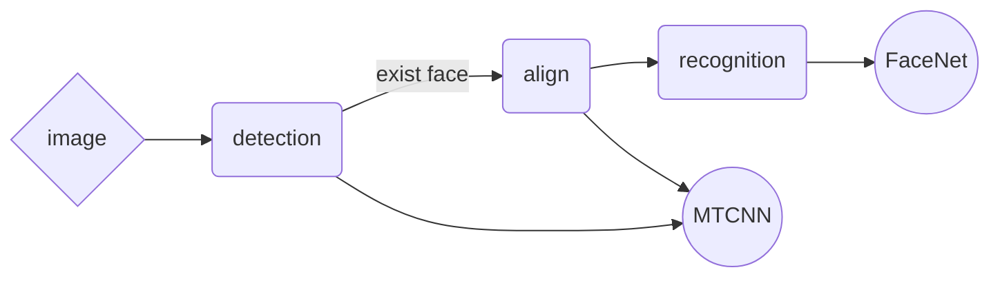

<!-- 
---
title: "faceNet学习笔记"    
author:     
date: Sep 04, 2018    

toc:    
  depth_from: 1    
  depth_to: 6    
  ordered: false     
  ignoreLink:false    
  
html:    
  embed_local_images: true    
  embed_svg: true    
  offline: false    
  toc: true    

print_background: false    

export_on_save:    
  html: true    

---
-->
# 
faceNet学习笔记

  

[FaceNet: A  Unified  Embedding for Face Recognition and Clustering](https://arxiv.org/abs/1503.03832)     

## 人脸识别系统基本流程   

## 文章亮点    
- 利用深度网络，直接将人脸图像映射到欧式空间中的向量，向量间的距离度量关联到人脸相似度的度量     
- 引入Triplet损失函数，提高了模型的表示效率      
- 生成训练集三元组时，会产生海量的三元组，选择最不相似和最相似的样本对作为三元组，大大减小了训练集      

## 文章流程图    
    

   
   

图像$x$经过深度网络结构后得到其向量表示，然后用$L2$正则化归一，将图像$x$嵌入到$d$维的欧式空间里，更进一步的，将其嵌入到$d$维的超球面上，即  $||f(x)||_2 =1$。后面直接连接Triplet Loss层。

## Triplet Loss     

   
      

对于一个给定的人脸图像$x_{i}^{a} (anchor)$,要求它和这个人的其他的图像$x_{i}^{p} (positive)$的距离尽可能小，和其他人的图像$x_{i}^{n} (negative)$的距离尽可能的大,数学化表述为      
$$
||f(x_{i}^{a}) - f(x_{i}^{p}) ||_{2}^{2} + \alpha < ||f(x_{i}^{a}) - f(x_{i}^{n})||_{2}^{2}
$$     
上述公式要对任意的三元组都成立   
$$\forall (f(x_{i}^{a}),f(x_{i}^{p}),f(x_{i}^{n})) \in \tau $$   
$\alpha$为正样本对和负样本对间的边界距离。     
生成所有的三元组会产生海量的三元组，所以必须进行选择。    

## Triplet Selection    
有两种可能的方法做选择    
- 采用离线方式，每$n$步生成一批三元组，然后用最新的网络在这部分数据集上计算，更新参数    
- 在线生成，在每一个mini-batch内选择正负样本对    

文章中选择的是在线方式，并且在每一个$mini-batch$内做进一步的选择，即选择最难区分的负样本对    

## Networks    
文章中采用了两种已有的网络结构     
- Zeiler&Fergus 文章中的网络    
- GoogLeNet  style Inception models   

