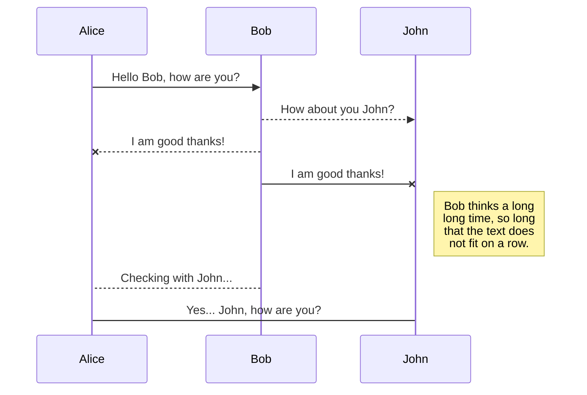
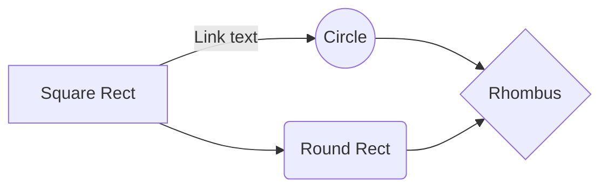

# <center>Markdown语法</center>  
[Visual Studio Code](https://code.visualstudio.com/) +   [Markdown Preview Enhanced](https://marketplace.visualstudio.com/items?itemName=shd101wyy.markdown-preview-enhanced) 打开本文档
<center> <font face="黑体">目录</font></center>     

[TOC]  

<div STYLE="page-break-after: always;"></div>

## 1 字体
###1.1强调
星号与下划线都可以，单是斜体，双是粗体，符号可跨行，符号可加空格

**一个人来到田纳西**
__毫无疑问__

*我做的馅饼
是全天下*

_最好吃的_

###1.2 字体、字号、颜色
<font face="黑体">我是黑体字</font>   
<font face="微软雅黑">我是微软雅黑</font>   
<font face="STCAIYUN">我是华文彩云</font>   
<font color=#0099ff size=12 face="黑体">黑体</font>   
<font color=#00ffff size=3>null</font>   
<font color=gray size=5>gray</font>      

### 1.3 斜体
*斜体*    
_将需要设置为斜体的文字两端使用1个 "\*" 或者 "\_" 夹起来_ 

### 1.4 粗体   
**将需要设置为粗体的文字两端使用2个"\*" 或者 "\_" 夹起来**

### 1.5 上标
30^th^

### 1.5 下标
H~2~O

### 1.6 标记 
==marked==

### 1.7  转义字符
Markdown中的转义字符为\，转义的有：   
\\ 反斜杠

\` 反引号

\* 星号

\_ 下划线

\{\} 大括号

\[\] 中括号

\(\) 小括号

\# 井号

\+ 加号

\- 减号

\. 英文句号

\! 感叹号   


## 2 段落与排版
### 2.1 分割线
三个或更多-_*，必须单独一行，可含空格   


---
***
___


### 2.2 标题：Setext方式   
通过在文字下方添加“=” 和 “-”，他们分别表示一级标题和二级标题   
```html
三个或更多   
大标题   
===   
小标题   
---
```

### 2.3 标题：Atx方式
```html
# 一级标题
## 二级标题
### 三级标题
#### 四级标题
##### 五级标题
###### 六级标题
```

### 2.4 无序列表
符号之后的空格不能少，-+*效果一样，但不能混合使用，因混合是嵌套列表，内容可超长   
- 无序列表
- 无序列表
- 无序列表
- 无序列表：我很长。我也很长！那比一比啊

符号之后的空格不能少，-+*效果一样，但不能混合使用，因混合是嵌套列表   
* 无序列表
* 无序列表
* 无序列表
* 无序列表：我很长。我也很长！那比一比啊   

### 2.5 有序列表
数字不能省略但可无序，点号之后的空格不能少   
1. 有序列表
2. 有序列表
3. 有序列表
8. 有序列表

### 2.6 嵌套列表
-+*可循环使用，但符号之后的空格不能少，符号之前的空格也不能少   
- 嵌套列表1
 + 嵌套列表2
 + 嵌套列表3
  - 嵌套列表4
   * 嵌套列表5
- 嵌套列表6

### 2.7  注释
用html的注释，好像只有这样？ 
```
<!-- 注释 -->   
```   

### 2.8 空格与缩进   
段落缩进（空格）   
半方大的空白&ensp;或&#8194;看，飞碟   
全方大的空白&emsp;或&#8195;看，飞碟   
不断行的空白格&nbsp;或&#160;看，飞碟   
&emsp;&emsp;段落从此开始。   

### 2.9 标签
行内标签          
快捷键 `Ctrl + D` 来收藏本页   

### 2.10 块注释 (blockquote)
>通过在文字开头添加“>”表示块注释。

>      当>和文字之间添加五个blank时，块注释的文字会有变化。
   
   
### 2.11 脚注 (footnote)
实现方式如下：   
hello[^hello]   

[^hello]: hi   


Content [^1]

[^1]: Hi! This is a footnote

### 2.12 缩略  
 
*[HTML]: Hyper Text Markup Language
*[W3C]:  World Wide Web Consortium
The HTML specification
is maintained by the W3C.

## 3 引用与链接    

### 3.1 引用
```html
> 引用
```
内层符号前的空格必须要   
```html
>引用
 >>引用中的引用
```


### 3.2 文字超链：Inline方式
Tooltips可省略   
[不如](http://bruce-sha.github.io "不如的博客")


### 3.3 索引超链：Reference方式
索引，1 可以是任意字符      
[不如][1]    

[1]:http://bruce-sha.github.io

### 3.4 自动链接
尖括号   
<http://ibruce.info>   
<bu.ru@qq.com>   

### 3.5 链接 (Links)
Markdown中有两种方式，实现链接，分别为内联方式和引用方式。   
内联方式：This is an [example link](http://example.com/).   
引用方式：
I get 10 times more traffic from [Google][2] than from [Yahoo][3] or [MSN][4].  

[2]: http://google.com/        "Google" 
[3]: http://search.yahoo.com/  "Yahoo Search" 
[4]: http://search.msn.com/    "MSN Search"

### 3.6 页面内跳转  
页面内跳转的链接写法为：  `[1.1 强调](#11强调)`  
[1.1 强调](#11强调)

标题中的数字和标题间不能有空格，但可以有点号，点号会被忽略。无论几级标题，引用时都只需一个 `#`。      
如 `### 1.2 字体、字号、颜色`，数字和标题汉字间有空格，无法zhengque正确引用。[1.2 字体、字号、颜色](#12字体、字号、颜色) 

## 4 代码    
### 4.1 代码：行内代码
在第一行后指定编程语言，也可以不指定    
``` python {.line-numbers}
@requires_authorization
def somefunc(param1='', param2=0):
    '''A docstring'''
    if param1 > param2: # interesting
        print 'Greater'
    return (param2 - param1 + 1) or None
class SomeClass:
    pass
>>> message = '''interpreter
... prompt'''
```
可代码高亮
```html {.line-numbers}
@requires_authorization
def somefunc(param1='', param2=0):
    '''A docstring'''
    if param1 > param2: # interesting
        print 'Greater'
    return (param2 - param1 + 1) or None
class SomeClass:
    pass
>>> message = '''interpreter
... prompt'''
```

### 4.2 代码：段落代码
每行文字前加4个空格或者1个Tab     
    val s = "hello Markdown"   
    println( s )    
    val s = "hello Markdown"    
    println( s )      
    
## 5 图片
### 5.1 图片大小与居中设置
设置图片大小   
   

设置图片居中

<div align=center>   </div>

### 5.2 图片超链
多个感叹号，Tooltips可省略，要设置大小只能借助HTML标记    
[](https://github.com/)

### 5.3 内嵌图标
微博的图标： `<i class="icon-weibo icon-2x"></i>` 
<i class="icon-weibo icon-2x"></i> 

替换 上述 `i 标签` 内的 `icon-weibo` 以显示不同的图标，例如：   `<i class="icon-renren"></i> `
即显示人人的图标：    <i class="icon-renren icon-2x"></i>      
更多的图标和玩法可以参看 [font-awesome](http://fortawesome.github.io/Font-Awesome/3.2.1/icons/) 官方网站。


## 6 表格

>Table 1   

| Tables        | Are           | Cool  |
| ------------- | :-----------: | ----: |
| col 3 is      | right-aligned | $1600 |
| col 2 is      | centered      | $12   |
| zebra stripes | are neat      | $1    |

>Table 2     
 
| 项目     | 价格  |
| -------- | ----- |
| Computer | $1600 |
| Phone    | $12   |
| Pipe     | $1    |

>Table 3  
 
| First Header                | Second Header                |
| --------------------------- | ---------------------------- |
| Content <br>from cell 1         | Content from<br> cell 2          |
| Content in the first column | Content in the second column |


>Table 4   

colspan `>` or `empty cell`:

| a   | b   |
| --- | --- |
| >   | 1   |
| 2   |     |


rowspan `^`:

| a   | b   |
| --- | --- |
| 1   | 2   |
| ^   | 4   |

>Table   

|太极|咏春|少林|
:---:|:---:|:---:
NB|NB|NB
test|test|test

### 6.1 Html 标签   
你可以用 Html 写一个纵跨两行的表格：   
```markdown
<table>
        <tr>
            <th rowspan="2">值班人员</th>
            <th>星期一</th>
            <th>星期二</th>
            <th>星期三</th>
        </tr>
        <tr>
            <td>李强</td>
            <td>张明</td>
            <td>王平</td>
        </tr>
    </table>
```

<table>
        <tr>
            <th rowspan="2">值班人员</th>
            <th>星期一</th>
            <th>星期二</th>
            <th>星期三</th>
        </tr>
        <tr>
            <td>李强</td>
            <td>张明</td>
            <td>王平</td>
        </tr>
</table>


## 7 数学公式
说明：部分 Markdown 预览器不支持，[Visual Studio Code](https://code.visualstudio.com/)中的 [Markdown Preview Enhanced](https://marketplace.visualstudio.com/items?itemName=shd101wyy.markdown-preview-enhanced)支持   
You can render LaTeX mathematical expressions using [KaTeX](https://khan.github.io/KaTeX/):   

The *Gamma function* satisfying $\Gamma(n) = (n-1)!\quad\forall n\in\mathbb N$  is via the Euler integral   


$$
\Gamma(z) = \int_0^\infty t^{z-1}e^{-t}dt\,.
$$

> You can find more information about **LaTeX** mathematical expressions [here](http://meta.math.stackexchange.com/questions/5020/mathjax-basic-tutorial-and-quick-reference).

  
[Markdown Preview Enhanced](https://shd101wyy.github.io/markdown-preview-enhanced/#/zh-cn/) 使用 [KaTeX](https://github.com/Khan/KaTeX) 或者 [MathJax](https://github.com/mathjax/MathJax) 来渲染数学表达式    
默认下的分隔符：   
- \$...\$ 或者 \\(...\\) 中的数学表达式将会在行内显示。   
- \$\$...\$\$ 或者 \\[...\\] 或者 ```math 中的数学表达式将会在块内显示    

$ f(x) = sin(x) +12 $   and   \( f(x) = cos(x) +1 \)   

$$f(x) = sin(x) + 12 $$
\[ f(x) = cos(x) +1 \]   

多行公式对齐   
```math
\begin{array}{l}
\quad (a + b)^2 \\
= (a + b) a + (a + b) b \\
= a^2 + ba+ ab + b^2 \\
= a^2 + 2ab + b^2 \\
\end{array}
```

## 8 Task Lists
- [x] Finish my changes   
- [ ] Push my commits to github   
- [ ] Open a pull request   


## 9 List edit   

- item1
    - item1.1
- item2

## 10 UML diagrams

### 10.1 Mermaid 流程图
You can render UML diagrams using [Mermaid](https://mermaidjs.github.io/). For example, this will produce a sequence diagram:



And this will produce a flow chart:



### 10.2 流程图   
示例
```flow
st=>start: Start:>https://www.zybuluo.com
io=>inputoutput: verification
op=>operation: Your Operation
cond=>condition: Yes or No?
sub=>subroutine: Your Subroutine
e=>end

st->io->op->cond
cond(yes)->e
cond(no)->sub->io
```
更多语法参考：[流程图语法参考](http://adrai.github.io/flowchart.js/)   

### 10.3 序列图   
示例 1

```seq
Alice->Bob: Hello Bob, how are you?
Note right of Bob: Bob thinks
Bob-->Alice: I am good thanks!
```

示例 2

```seq
Title: Here is a title
A->B: Normal line
B-->C: Dashed line
C->>D: Open arrow
D-->>A: Dashed open arrow
```

更多语法参考：[序列图语法参考](http://bramp.github.io/js-sequence-diagrams/)   

### 10.4 甘特图   
甘特图内在思想简单。基本是一条线条图，横轴表示时间，纵轴表示活动（项目），线条表示在整个期间上计划和实际的活动完成情况。它直观地表明任务计划在什么时候进行，及实际进展与计划要求的对比。
```gantt
    title 项目开发流程
    section 项目确定
        需求分析       :a1, 2016-06-22, 3d
        可行性报告     :after a1, 5d
        概念验证       : 5d
    section 项目实施
        概要设计      :2016-07-05  , 5d
        详细设计      :2016-07-08, 10d
        编码          :2016-07-15, 10d
        测试          :2016-07-22, 5d
    section 发布验收
        发布: 2d
        验收: 3d
```

更多语法参考：[甘特图语法参考](https://knsv.github.io/mermaid/#gant-diagrams)

## 11 Emoji & Font-Awesome
>只适用于 markdown-it parser 而不适用于 pandoc parser。   
>缺省下是启用的。你可以在插件设置里禁用此功能。   

:smile:   
:fa-car:


## 12 目录与导航栏设置   
Markdown Preview Enhanced 支持你在 markdown 文件中创建 ==TOC==。 你可以通过 ==cmd-shift-p== 然后选择 ==Markdown Preview Enhanced: Create Toc== 命令来创建 ==TOC==。 多个 TOCs 可以被创建。 如果你想要在你的 ==TOC== 中排除一个标题，请在你的标题 后面 添加 =={ignore=true}== 即可   

>TOC 将会在你的 markdown 文件保存时更新。 你需要保持预览打开才能更新 TOC   

设置
- orderedList 是否使用有序列表。
- depthFrom, depthTo [1~6] 包含的。
- ignoreLink 如果设置为 true，那么 TOC 将不会被超链接。

你也可以通过在你的 markdown 文件中输入 [TOC] 来创建 TOC。 例如：   

```html
[TOC]

# 标题1
## 标题2 {ignore=true}
标题2 将会被目录忽略.
```
但是，这种方式创建的 TOC 只会在预览中显示，而不会修改你的 markdown 文件。   
[TOC] 以及边栏 TOC 的设置   
你可以通过编写 front-matter 来进行设置： 
   
```
---
toc:
  depth_from: 1
  depth_to: 6
  ordered: false
---
```
    
   


Reference:   
[Markdown 语法 示例 字体 字号 颜色](http://blog.csdn.net/u011419965/article/details/50536937)   
[MarkDown readme图片尺寸固定且居中](http://blog.csdn.net/jingbin_/article/details/52960826)   
[Markdown 11种基本语法](https://www.cnblogs.com/hnrainll/p/3514637.html)   
[Markdown Preview Enhanced](https://shd101wyy.github.io/markdown-preview-enhanced/#/zh-cn/)      
[在线的Markdown编辑器](https://stackedit.io/ )   
[Cmd Markdown 简明语法手册](https://www.zybuluo.com/mdeditor?url=https://www.zybuluo.com/static/editor/md-help.markdown#3-外链接)   
[emoji表情](https://github.com/guodongxiaren/README/blob/master/emoji.md)   
[GitHub官方emoji表情](http://www.emoji-cheat-sheet.com)
